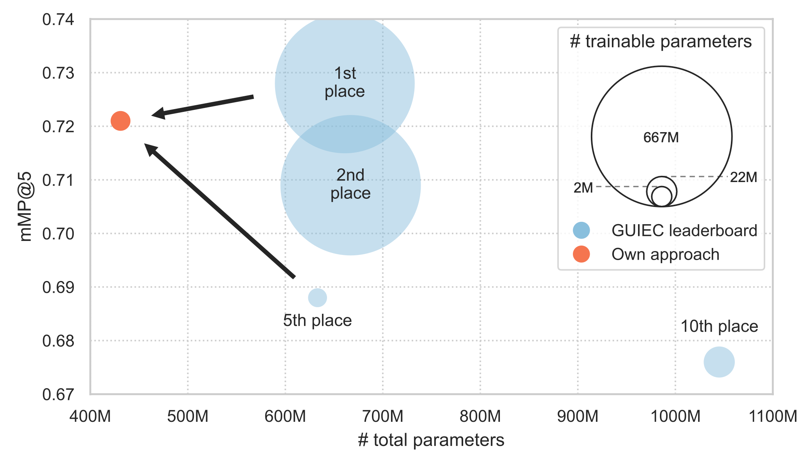
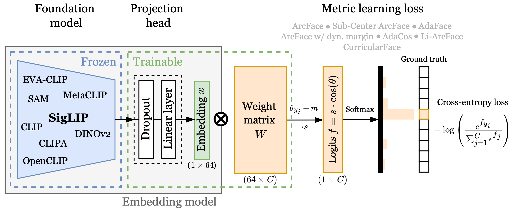

# Efficient and Discriminative Image Feature Extraction for Universal Image Retrieval

This repository contains the code associated with the publication "Efficient and Discriminative Image Feature Extraction 
for Universal Image Retrieval," which was accepted for presentation at this year's [DAGMA German Conference on Pattern 
Recognition (GCPR)](https://www.gcpr-vmv.de/year/2024).

### Abstract
Current image retrieval systems often face domain specificity and generalization issues. This study aims to overcome these 
limitations by developing a computationally efficient training framework for a universal feature extractor that provides 
strong semantic image representations across various domains. To this end, we curated a multi-domain training dataset, called 
*M4D-35k*, which allows for resource-efficient training. Additionally, we conduct an extensive evaluation and comparison 
of various state-of-the-art visual-semantic foundation models and margin-based metric learning loss functions regarding 
their suitability for efficient universal feature extraction. Despite constrained computational resources, we achieve near 
state-of-the-art results on the [Google Universal Image Embedding Challenge (GUIEC)](https://www.kaggle.com/competitions/google-universal-image-embedding), 
with a *mMP@5* of 0.721. This places our method at the second rank on the leaderboard, just 0.7 percentage points behind 
the best performing method. However, our model has 32% fewer overall parameters and 289 times fewer trainable parameters. 
Compared to methods with similar computational requirements, we outperform the previous state of the art by 3.3 percentage 
points.


**Figure 1:** Results on the GUIEC test set. Comparing our approach to the GUIEC leaderboard by plotting the evaluation 
metric *mMP@5* over the number of total model parameters. The bubble’s area is proportional to the number of trainable 
model parameters.

## Table of Contents
- [I. Setup](#i-setup)
- [II. Data Preparation](#ii-data-preparation)
- [III. Embedding Model](#iii-embedding-model)
- [IV. Training](#iv-training)
- [V. Evaluation](#v-evaluation)

## I. Setup
Here, we describe a step-by-step guide to setup and install dependencies on a UNIX-based system, such as Ubuntu, using 
`conda` as package manager. If `conda` is not available, alternative package managers such as `venv` can be used.

#### 1. Create a virtual environment
```
conda create -n env_unifex python=3.8
conda activate env_unifex
```
#### 2. Clone the repository
```
git clone git@github.com:morrisfl/UniFEx.git
```
#### 3. Install pytorch
Depending on your system and compute requirements, you may need to change the command below. See [pytorch.org](https://pytorch.org/get-started/locally/) 
for more details. In order to submit the embedding models to the 2022 [GUIEC](https://www.kaggle.com/competitions/google-universal-image-embedding), 
PyTorch 1.11.0 is required.
```
conda install pytorch==1.11.0 torchvision==0.12.0 cudatoolkit=11.3 -c pytorch
```
#### 4. Install the repository with all dependencies
```
cd UniFEx
python -m pip install .
```
If you want to make changes to the code, you can install the repository in editable mode:
```
python -m pip install -e .
```
#### 5. Setup Google Drive access (optional)
In order to automatically upload checkpoints to Google Drive, you need to create a Google Drive API key. 
Setup instructions can be found [here](src/utils/GOOGLE_DRIVE.md). If you don't want to upload checkpoints to Google Drive,
please set the `MODEL.cloud_upload` parameter in the configuration file to `False`.

## II. Data Preparation
In the process of fine-tuning/linear probing the embedding models, different datasets and dataset combinations can be used.
The list of available datasets, and information about pre-processing, downloading and how to use them for training can be 
found [here](src/datasets/DATASET.md).

### *M4D-35k*
The *M4D-35k* dataset is a custom curated multi-domain training dataset. It was created for resource-efficient training of 
multi-domain image embeddings. The curation process involved dataset selection and data sampling (optimize data size) by 
maximizing the performance on the GUIEC evaluation dataset. *M4D-35k* consists of 35k classes and 328k images sourced 
from four different datasets:

| Domain                | Dataset                                                                                                           | # classes | # images |
|-----------------------|-------------------------------------------------------------------------------------------------------------------|:---------:|:--------:|
| Packaged goods        | [Products-10k](https://products-10k.github.io)                                                                    |   9.5k    |  141.5k  |
| Landmarks             | [Google Landmarks v2](https://www.kaggle.com/c/landmark-recognition-2021/data) (subset)                           |   10.0k   |  79.2k   |
| Apparel & Accessories | [DeepFashion (Consumer to Shop)](https://www.kaggle.com/datasets/sangamman/deepfashion-consumer-to-shop-training) |   14.3k   |  100.4k  |
| Cars                  | [Stanford Cars](https://www.kaggle.com/datasets/jessicali9530/stanford-cars-dataset) (refined)                    |   1.0k    |   7.3k   |
| Multi-Domain          | *M4D-35k*                                                                                                         |   34.8k   |  328.4k  |

Notable, the Stanford Cars dataset was refined by enhancing the class granularity. Instead of classifying cars only by their
model, the class labels were extended to the car color. More information about the refinement process can be found [here](https://github.com/morrisfl/stanford_cars_refined).

The corresponding annotations of the *M4D-35k* dataset can be found in `data/m4d-35k_train.csv`. Make sure to download the 
corresponding datasets included in the *M4D-35k* dataset and place them in a `<data_dir>` of your choice. More information
about the dataset and directory structure can be found [here](src/datasets/DATASET.md).

To use *M4D-35k* for training, add `m4d_35k` to the `DATASET.names` parameter in the configuration file in `configs/`.

## III. Embedding Model

**Figure 2:** Overview of the model architecture. The image embedding model consists of a visual-semantic foundation model
as backbone, followed by a projection head. During training the model is optimized using a margin-based metric learning
loss function.

Different foundation models can be used, as shown in the table below.

|                          Foundation Model                          | Encoder architecture |     `type`      |                         `model_name`                         |                         `weights`                          |
|:------------------------------------------------------------------:|:--------------------:|:---------------:|:------------------------------------------------------------:|:----------------------------------------------------------:|
|       [OpenCLIP](https://github.com/mlfoundations/open_clip)       |         ViT          |     `clip`      |  see [OpenCLIP](https://github.com/mlfoundations/open_clip)  | see [OpenCLIP](https://github.com/mlfoundations/open_clip) |
 |       [OpenCLIP](https://github.com/mlfoundations/open_clip)       |       ConvNeXt       | `clip_convnext` |  see [OpenCLIP](https://github.com/mlfoundations/open_clip)  | see [OpenCLIP](https://github.com/mlfoundations/open_clip) |
 |            [CLIPA](https://github.com/UCSC-VLAA/CLIPA)             |         ViT          |    `clipav2`    |  see [OpenCLIP](https://github.com/mlfoundations/open_clip)  | see [OpenCLIP](https://github.com/mlfoundations/open_clip) | 
 | [EVA-CLIP](https://github.com/baaivision/EVA/tree/master/EVA-CLIP) |         ViT          |     `eva02`     | see [timm](https://huggingface.co/timm?search_models=eva02)  |                             -                              | 
 |      [MetaCLIP](https://github.com/facebookresearch/MetaCLIP)      |         ViT          |   `meta-clip`   |  see [OpenCLIP](https://github.com/mlfoundations/open_clip)  | see [OpenCLIP](https://github.com/mlfoundations/open_clip) | 
 |             [SigLIP](https://arxiv.org/abs/2303.15343)             |         ViT          |    `siglip`     | see [timm](https://huggingface.co/timm?search_models=siglip) |                             -                              |
 |        [DINOv2](https://github.com/facebookresearch/dinov2)        |         ViT          |    `dinov2`     | see [timm](https://huggingface.co/timm?search_models=dinov2) |                             -                              |
 |    [SAM](https://github.com/facebookresearch/segment-anything)     |         ViT          |      `sam`      | see [timm](https://huggingface.co/timm?search_models=samvit) |                             -                              |

In order to adjust the model architecture of the image embedding model, the following main parameters can be changed in the
configuration file:
- `MODEL.embedding_dim`: the dimension of the image embedding.
- `MODEL.BACKBONE.type`: the type of the visual-semantic foundation model, supported types are those listed in the table above.
- `MODEL.BACKBONE.model_name`: the name of the visual-semantic foundation model, specified by OpenCLIP or timm.
- `MODEL.BACKBONE.weights`: the weights of the visual-semantic foundation model, only required for OpenCLIP models (corresponds to the pretrained parameter in [OpenCLIP](https://github.com/mlfoundations/open_clip)).
- `MODEL.NECK.type`: the type to reduce the embedding dimension to the specified `MODEL.embedding_dim`, supported types are `proj_layer` and `pooling`.
- `MODEL.HEAD.name`: the name of the margin-based metric learning loss, supported names are `ArcFace`, `DynM-ArcFace`, `AdaCos`, `LiArcFace`, `CurricularFace`, and `AdaFace`.
- `MODEL.HEAD.k`: the number of centers for the margin-based metric learning loss.
- `MODEL.HEAD.s`: the scaling factor for the margin-based metric learning loss.
- `MODEL.HEAD.m`: the margin for the margin-based metric learning loss.

Further explanations of changeable parameters can be found in the [default_cfg.py](src/utils/default_cfg.py).


## IV. Training
### Training settings
The training settings can be changed in the configuration file found in `configs/`. The most important parameters are:
- `TRAIN.epoch_based`: if `True`, the training is based on the number of epochs, otherwise on the number of iterations.
- `TRAIN.epochs`: the number of epochs to train the model.
- `TRAIN.save_epoch`: the frequency of saving the model checkpoint.
- `OPTIMIZER.name`: the optimizer used for training, supported optimizers are `Adam`, `AdamW` and `SGD`.
- `OPTIMIZER.lr`: the learning rate of the optimizer.
- `OPTIMIZER.weight_decay`: the weight decay of the optimizer.
- `SCHEDULER.name`: the learning rate scheduler used for training, supported schedulers are `CosineAnnealingLR`.
- `SCHEDULER.epoch_based`: if `True`, the scheduler is based on the number of epochs, otherwise on the number of iterations.
- `SCEDULER.min_lr`: the minimum learning rate of the scheduler.
- `SCHEDULER.warmup`: the type of warmup to use, supported warmups are `linear` and `exponential`.
- `SCHEDULER.warmup_steps`: the number of warmup steps. If the value is 1, the steps are equivalent to the number of iterations of one epoch.

Further explanations of changeable parameters can be found in the [default_cfg.py](src/utils/default_cfg.py).

### Training run
To start the training, run the following command:
```
python tools/train.py configs/<config_file> <data_dir> \
    --output-dir results/ \
    --data_parallelism \
    --device cuda:0
```
The `<config_file>` corresponds to the configuration file in `configs/` and `<data_dir>` to the directory where the datasets
are stored. The `--output-dir` parameter specifies the directory where the training results are stored. The `--data_parallelism`
parameter enables the use of multiple GPUs for training (available GPU IDs must be specified in the configuration file under
`TRAIN.gpu_ids`). The `--device` parameter specifies the device to use for training.

### Zero-shot model
To create a zero-shot model, which can be used for zero-shot evaluate, run the following command:
```
python tools/zero_shot_model.py configs/<config_file>
```
Within the `<config_file>`, the model architecture should be specified. The zero-shot model will be saved in the `results/`. 
If the `MODEL.cloud_upload` parameter in the configuration file is set to `True`, the zero-shot model will be uploaded 
to Google Drive.

## V. Evaluation
This repository does not provide any evaluation scripts. However, the evaluation of the trained embedding models can be
performed on the [Google Universal Image Embedding Challenge](https://www.kaggle.com/competitions/google-universal-image-embedding)
hosted on Kaggle. The evaluation dataset consists of 5k query images and 200k index images across 11 different domains.
The evaluation metric is the modified mean precision at 5 (mMP@5). 

For evaluation, the trained embedding model has to be uploaded to Kaggle, where a scoring notebook performs feature extraction
and metric computation on the evaluation dataset. In `notebooks/` a template notebook is provided, which can be used to
submit the trained embedding model to the challenge. Please note, this notebook downloads the embedding model from Google
Drive. Therefore, the `model_name` and download `url` (shared link) have to be specified.

