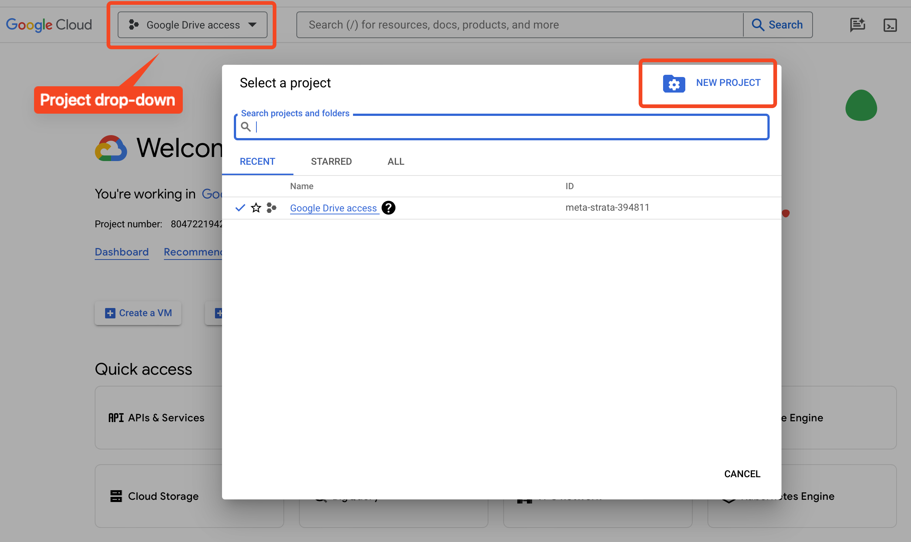
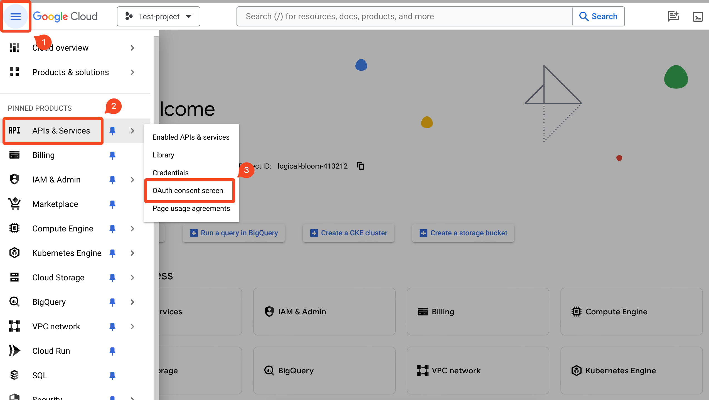
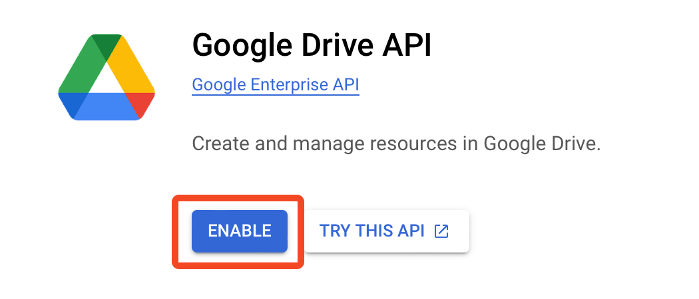
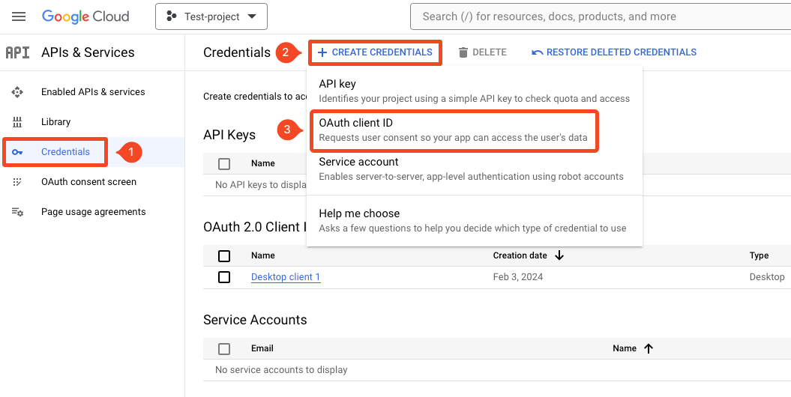

## Google Drive API
This is a step-by-step guide on how to set up Google Drive API which can be used to automatically upload model checkpoints 
to Google Drive. Further information can be found [here](https://developers.google.com/drive/api/v3/quickstart/python).

### Step 1: Create a Google Cloud project
1. Go to the [Google Cloud Dashboard](https://console.cloud.google.com/).
2. Click on the project drop-down and select `New Project`.
3. Give your project a name and click `Create`.
4. Once the project is created, select it from the project drop-down.



### Step 2: Create the OAuth Page
1. Go to Navigation Menu > APIs & Services > OAuth consent screen.
2. Select `External` as the user type and click `Create`.
3. Fill in the required fields and click `Save and Continue`.
4. `Scopes` can be skipped, since we define them in the script.
5. `Test users` can be skipped as well.
6. Review the OAuth consent screen and click `Back to Dashboard`.



### Step 3: Enable the Google Drive API
1. Within APIs & Services, go to `Library`.
2. Search for `Google Drive API` and click on it.
3. Click `Enable`.



### Step 4: Create the credentials
1. Within APIs & Services, go to `Credentials`.
2. Click `Create Credentials` and select `OAuth client ID`.
3. Select `Desktop app` as the application type, give it a name and click `Create`.
4. A pop-up will appear with your client ID and client secret. Download the JSON file.
5. Rename the JSON file to `client_secret.json` and place it in the `credentials/` folder.



### Step 5: Create authorization token file
Run the following command to create the `token_drive_v3.pickle` file which will be stored in the `credentials/` folder.
```
python tools/create_drive_token.py
```
Please note, this token file will expire after 7 days. If you want to create a new token, simply run the command again.

### Step 6: Specify Google Drive folder
In the [default_cfg.py](default_cfg.py) file, specify the Google Drive folder ID where you want to upload the model 
checkpoints. The folder ID can be found in the URL of the folder. For example, the folder ID in the URL 
https://drive.google.com/drive/folders/1X2Y3Z4A5B6C7D8E9F0G is `1X2Y3Z4A5B6C7D8E9F0G`.

### Step 7: Enable model checkpoint upload to Google Drive
Once everything is set up, you can enable the upload of model checkpoints to Google Drive by setting the `MODEL.cloud_upload`
parameter to `True` in the configuration file in `configs/`.